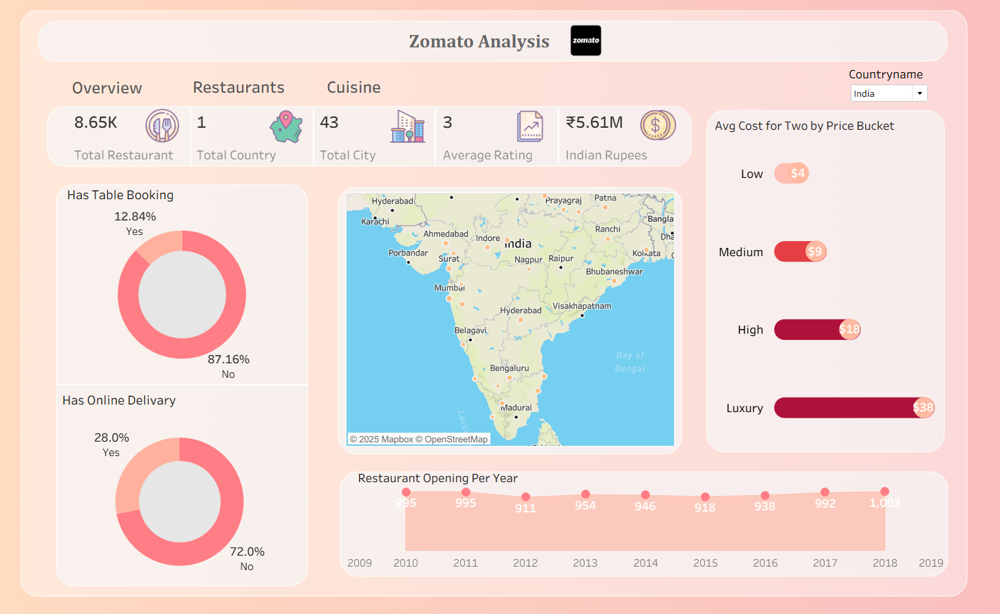

#  Zomato Analysis Dashboard – Excel & Tableau

A simple and interactive dashboard analyzing Zomato restaurant data using **Excel** for cleaning and **Tableau** for visualization.  
The dashboard provides key insights on restaurant availability, pricing, bookings, delivery, and city-wise distribution.

---

## 📊 Key Features
- **8.65K Restaurants**, **43 Cities**, **3 Avg Rating**
- Table Booking: **12.84% Yes**, **87.16% No**
- Online Delivery: **28% Yes**, **72% No**
- Price Buckets: Low ($4), Medium ($9), High ($18), Luxury ($38)
- Restaurant openings from **2009–2019**
- Interactive **India map** showing major restaurant locations

---

## 🛠 Tools Used
- **Excel** → Data cleaning & preprocessing  
- **Tableau** → Dashboard creation & visualization  

---

##  Dashboard Preview
  

---

## 📂 Files Included
- `Zomato_Dataset.xlsx`  
- `Zomato_Analysis_Dashboard.twbx`  
- Dashboard screenshot  
- README

